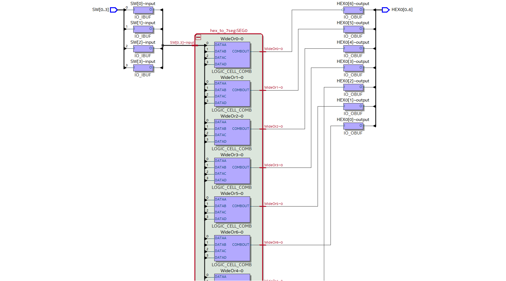
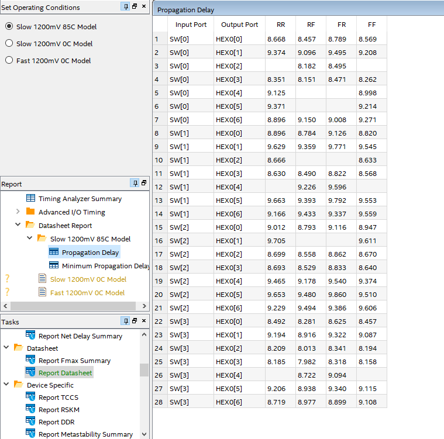

# Logbook for Information Processing Group 0
## Antoine, Derek, Joel, Pirong, Soon Yung

## Task 1

### Verilog Implementation - 7 Segment Decoder and Top Level Module

First, the 7-segment decoder was implemented in verilog as follows:

The top-level module was then created as follows:

### Pin assignment

Next step is to perform pin assignments so the actual pins on the DE-10 board can be used as inputs for the top-level module. The first way is to manually use the pin assignment tool to assign each bit of input / output to a corresponding pin, as follows:

Here, the MSBs of HEX0 output and SW input are assigned to pins C17 and C12 respectively, with 3.0V voltage standard. These pin assignments can be seen in the Quartus Setting File as follows:

Alternatively, instead of using the pin planner tool, the necessary lines can be written on a txt file and simply copied into the qsf file, as follows:

### Compilation and Blasting

Next step is to perform compilation, which compiles the code, and performs placement, routing, fitting, etc. It produces a bit-stream file (.sof file), which can be used to blast the FPGA. Once the bit-stream has been successfully sent to the FPGA chip, it basically takes over the function of the chip.

The Programmer tool can now be used to select the newly-created .sof file and sent to the FPGA chip, so that our design takes over the functionality of the chip:

### Testing

Once blasted, the FPGA chip implements our functionalities, as follows:

## Task 2

### Netlist Viewer

A graphical view of the synthesized design can be visualised to see how the Verilog HDL is turned into actual FPGA hardware.

The netlist viewer can also show the Boolean logic:

We can see from the Netlist viewer that when we pass in the 4-bits of SW, Quartus first uses a 4-bit to 16-bit decoder (or one-hot encoder). Basically based on the input value, only one output line will be asserted. E.g. if the input is 1111, corresponding to 15, then output 15 of the decoder will be 1, and the rest will be 0.

These 15 decoder bits are then passed through 7 OR gates to generate the 7 bits which are then formed into the output. **Important note: the OR gates are numbered in reverse order of the bit positions**. In other words, the OR gates are used to generate the following output bits:

| Gate | Bit |
|------|-----|
| WideOr0 | Bit 6 |
| WideOr1 | Bit 5 |
| WideOr2 | Bit 4 |
| WideOr3 | Bit 3 |
| WideOr4 | Bit 2 |
| WideOr5 | Bit 1 |
| WideOr6 | Bit 0 |

For example if we look at `WideOr0`, if the input value is 0, 1, 7 or 12, then the MSB of the output will be 1. This tallies with the logic in the `case` statement of our Verilog HDL code.

We can also use the `Technology Map Viewer - Post Mapping` tool showing the following schematic:

This shows a graphical representation of the design after the mapping phase of the compilation process. It shows how our design is translated into logical primitives and resources available on the FPGA. This is an intermediate step before placement and routing.

In general, the technology map viewer (post-mapping) has the following features:

- Logic elements and primitives (e.g. logic gates, FFs, MUXes, memory blocks)
- Interconnections 

In our viewer, the `SW` and `HEX0` input and outputs are passed through input and output buffers, `IO_IBUF` and `IO_OBUF`. These buffers essentially protect signal integrity by ensuring proper electrical interfacing between the FPGA internal logic and the actual pins, e.g. ensuring that the voltage levels are driven correctly. The internal signals then interface with the `hex_to_7seg` module. We can also see the technology map viewer for the `hex_to_7seg` module:

We can see that internally, the `hex_to_7seg` module is composed of the 7 WideOr blocks as explained above. 

The technology map viewer is linked to the compilation report. For example, we can view the resource summary:

For instance, the compilation report shows that we have 7 logic elements with 4 LUT inputs. Linking to the technology map viewer, these are the 7 WideOr blocks. We also have another logic unit with <= 2 LUT inputs. This is the overall `hex_to_7seg` logic unit with 1 input. Hence, the compilation report includes a breakdown of the FPGA resources used, and the technology map viewer visually represents these resources allowing us to visualise the resource assignments.

### Timing Analyzer

Using the Timing Analyzer tool, we can use the `Report Datasheet` function to view the propagation delays of all the paths in our design:

The timing analyzer tool measures propagation delays from an input pin to an output pin, or from one internal point to another within the FPGA. It can be used to analyze the critical path in the design, and to ensure the design meets setup and hold time requirements. In general, it can measure the following delays:

- Input to Output delays: delay from external input pin to external output pin through combinational logic in the FPGA
- Input to Register delays: delay from an input pin to the data input of a register within the FPGA 
- Register to Output delays: delay from a register within the FPGA to an output pin
- Clock to Q delays: delay from the time a clock edge triggers a flip-flop to the time the Q output of the flip-flop stabilises

With reference to the table, the RR, RF, FR and FF fields indicate the type of transition, as follows:

| Transition | Description |
|------------|-------------|
| RR | Delay when the input transitions from 0 to 1 and the output transitions from 0 to 1 |
| RF | Delay when the input transitions from 0 to 1 and the output transitions from 1 to 0 |
| FR | Delay when the input transitions from 1 to 0 and the output transitions from 0 to 1 |
| FF | Delay when the input transitions from 1 to 0 and the output transitions from 1 to 0 |

We can set the operating conditions to `Slow 85C model`, `Slow 0C model` and `Fast 0C model` to compare the propagation delays in each case.

The slow and fast models have different assumptions about the behaviour of the FPGA's transistors. For example, the slow model assumes slow transistor switching speed. The fast and slow models are used to profile the best-case and worst-case propagation delays respectively, hence naturally the fast model has less propagation delay.

In general, the slow model performs better (less propagation delays) at 0C compared to 85C for the following reasons:

1. At lower temperatures, the mobility of charge carriers in the semiconductor material is higher, leading to faster switching of transistors. At higher temperatures, carrier mobility is reduced due to increased lattice vibrations
2. Lower temperatures result in smaller interconnect resistance, leading to less propagation delays
3. Higher temperatures may lead to more voltage drops across the chip due to increased resistive losses, degrading performance.

### Extended Design: Using all 10 switches

The last step is to extend the design to include all 10 switches to output the hexadecimal number using 3 digits of the 7 segment display.

To perform this, we need to instantiate 3 copies of the `hex_to_7seg` module so that we can generate 3 digits on the 7-segment display. We need to pass bits 3:0 into one of them, bits 7:4 into the second copy, and bits 9:8, left-padded with 0s, into the third copy.

From the QSF (Quartus Settings File), we can see that the file assigns the relevant pins to `SW[9:0]`, hence we can just pass in SW as a 10-bit input into our top-level task 2 module. Additionally, we also see that the QSF assigns the relevant pins for digits 1 and 2 of the 7-segment display to `HEX1[6:0]` and `HEX2[6:0]` respectively, as follows:

Hence, this means that we can simply instantiate 3 copies of the `hex_to_7seg` module, use one of them to output `HEX0`, one of them to output `HEX1`, and one of them to output `HEX2`. Thus the top-level module is implemented as follows:

After the relevant steps (device assignment, pin assignment in the QSF, compilation, blasting), the following images show the full functionality of the extended design:

